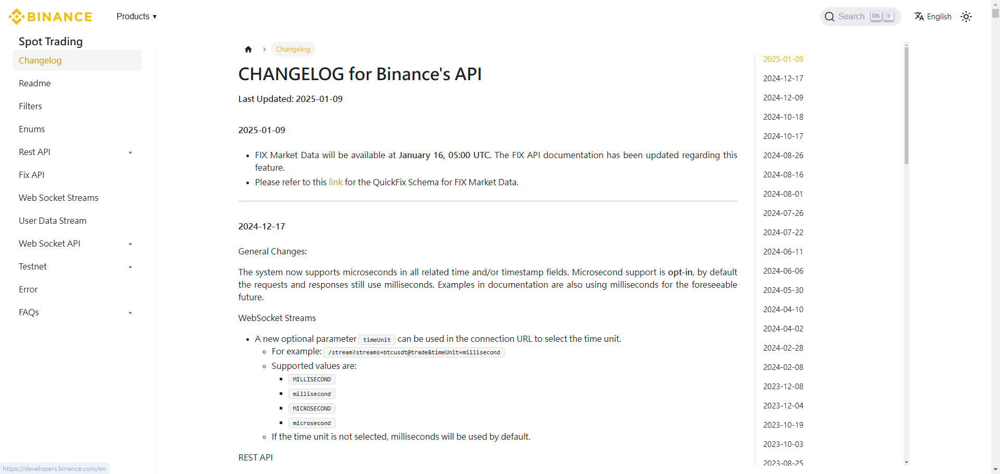
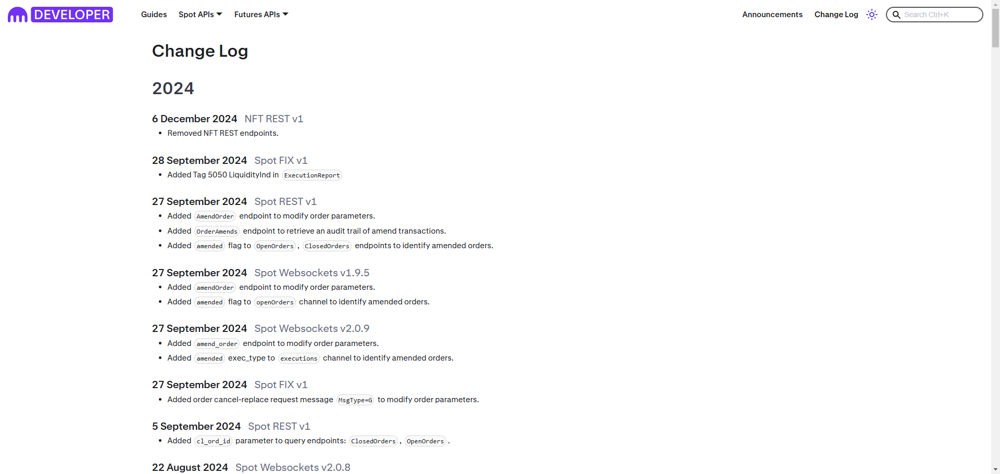
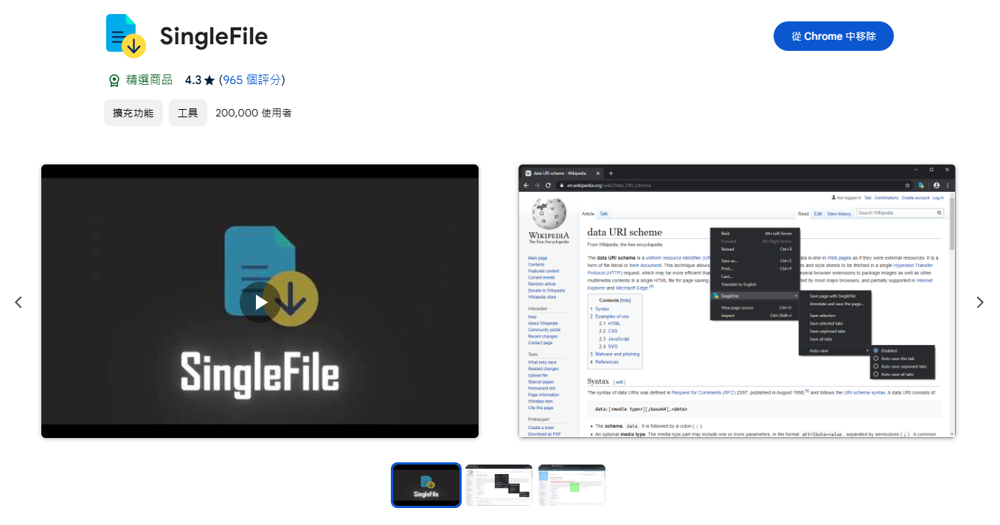

---

# 故事大概是這樣

- 遇到了什麼事？
- 我有哪些工具？該怎麼辦？
- 好像解掉了但又沒有解掉
- 算了我懶得管它了

---

# 我是誰

- Narumi
- 學過一點數學，但我數學不好
- Machine Learning Engineer / Data Scientist
- 目前在 MaiCoin 工作


---

# MaiCoin/MAX 是什麼？

- (貨幣兌換) MaiCoin 是一個虛擬貨幣代買代售的平台
- (交易所) MAX 是一個虛擬貨幣交易所


---

# MaiCoin 怎麼決定價格？

- 參考其他家的幣商或交易所的價格
- 所以要接很多家幣商或交易所的 APIs，並且維護
- 不會只有報價這一個需求

---

# 接哪些交易所？

- Binance [Spot](https://developers.binance.com/docs/binance-spot-api-docs)/[Margin](https://developers.binance.com/docs/margin_trading/change-log)/[Derivatives](https://developers.binance.com/docs/derivatives/change-log)
- [Bitfinex](https://docs.bitfinex.com/docs/changelog)
- [Kraken](https://docs.kraken.com/api/docs/change-log)
- [CoinBase](https://docs.cdp.coinbase.com/exchange/docs/changelog/)
- [Bybit](https://bybit-exchange.github.io/docs/changelog/v5)
- [Bitget](https://www.bitget.com/api-doc/common/changelog)
- [OKX](https://www.okx.com/docs-v5/log_en)
- ...

---

# [Binance Spot Trading Changelog](https://developers.binance.com/docs/binance-spot-api-docs)



---

# [Kraken Changelog](https://docs.kraken.com/api/docs/change-log)



---

# 麻煩在哪？（小時候）

- 需要定期檢查每間交易所 changelog 頁面是否有重要的 breaking change
- 每間交易所頁面的格式都不一樣，慢慢寫就好，應該不困難，但就是麻煩
- 交易所的網頁也可能會改版，要重新寫

---

# 現在可以怎麼做？

丟給語言模型，叫他抽給你，夭壽方便，但是

- 需要轉成結構化的輸出(structured output)，至少日期格式要一致
- 語言模型可能產生幻覺(hallucination)唬爛你或是不獸控制，要好好寫 prompt

---

# 流程

- 抓各大交易所的 changelog 頁面
- 把 html 轉換成 markdown，砍掉不需要的部分
- 叫語言模型把 markdown 中的**變更項目**與其對應的日期抽出來
- 過濾掉不是最近的**變更項目**
- 把結果打到 Slack channel

---

# 探索的過程（失敗）

- 給今天的日期直接叫語言模型找最近的幾則，效果很差
- Changelog 頁面很長，記得砍掉不需要的部分

---

# 抓網頁的工具

- [HTTPX vs Requests vs AIOHTTP](https://oxylabs.io/blog/httpx-vs-requests-vs-aiohttp)
  - Requests - 小時候常用，不支援 Async，也不支援 HTTP/2
  - [HTTPX](https://www.python-httpx.org/) - 後來改用這個了
  - AIOHTTP - 專門為了 Async 設計，想要快就用這個
- [Cloudscraper](https://github.com/venomous/cloudscraper) - 撈 Cloudflare 的頁面用，不一定會成功，但可以試試看

我無腦用 HTTPX 和 Cloudscraper

---

# 簡單的範例 (HTTPX)

```python
import httpx


url = "https://developers.binance.com/docs/binance-spot-api-docs"
resp = httpx.get(url, follow_redirects=True)
resp.raise_for_status()

print(resp.text)
```

---

# 抓網頁的工具（需要瀏覽器）

- [Selenium](https://www.selenium.dev/) - 老工具，不解釋
- [Playwright](https://playwright.dev/) - 微軟在 2020 年發布的工具，速度快
- [SingleFile](https://chromewebstore.google.com/detail/singlefile/mpiodijhokgodhhofbcjdecpffjipkle) - 一個 Chrome 的套件，可以一鍵抓下整個網頁儲存成單一檔案，[SingleFile CLI](https://github.com/gildas-lormeau/single-file-cli) 版本
  - docker: `docker run capsulecode/singlefile "https://docs.cdp.coinbase.com/exchange/docs/changelog/" >> coinbase.html`

目前的偏好是 Playwright >= SingleFile > Selenium

---

# [SingleFile](https://chromewebstore.google.com/detail/singlefile/mpiodijhokgodhhofbcjdecpffjipkle?hl=zh-TW)

一個一鍵抓下整個網頁儲存成單一檔案的 Chrome 套件



---

# 簡單的範例 (SingleFile CLI)

[Prerequisite: install single-file cli with npm](https://github.com/gildas-lormeau/single-file-cli?tab=readme-ov-file#manual-installation)

```python
import subprocess
from pathlib import Path


subprocess.run(
    [
        "single-file",
        "--browser-load-max-time=10_000", # 等待網頁載入的時間(等JavaScript)
        "--block-images=true", # 不要抓圖片
        "--filename-conflict-action=overwrite", # 若檔案已存在，覆蓋
        "https://docs.cdp.coinbase.com/exchange/docs/changelog",
        "coinbase.html",
    ]
)
with Path(filename).open() as fp:
    print(fp.read())
```

---

# 為什麼要轉成 Markdown？

**Pros**

- 省 token，處理效率高
- 讓 LLM 專注在文字上，不用管 HTML 的 tag
- 對人來說比較好閱讀

**Cons**

- 結構比較沒有 HTML 完整

---

# 簡單的 [Markdownify](https://github.com/matthewwithanm/python-markdownify) 範例

把 HTML 轉成比較好讀的 Markdown 格式

```python
import httpx
from markdownify import markdownify as md


url = "https://www.google.com"
resp = httpx.get(url)
resp.raise_for_status()

markdown = md(resp.text, strip=["a", "img"]) # 不要連結和圖片
print(trim_and_filter_lines(markdown))
```

---

# 清掉空白和換行

```python
def trim_and_filter_lines(text: str) -> str:
    """
    Trims whitespace from each line in the given text and filters out empty lines.

    Args:
        text (str): The input text containing multiple lines.

    Returns:
        str: A string with each line trimmed of leading and trailing whitespace and empty lines removed.
    """
    lines: list[str] = []
    for line in text.splitlines():
        stripped = line.strip()
        if stripped:
            lines += [stripped]
    return "\n".join(lines)
```

---

# 資訊抽取 (Information Extraction)

~~小時候~~ vs 以前 vs 現在

上古時代就不說了

---

# 以前（2023）

- 利用 [function calling](https://platform.openai.com/docs/guides/function-calling)
- 把你想抽取的資訊當作 function arguments，叫 LLM 告訴你該怎麼 call
  - [LangChain OpenAI Extraction](https://github.com/langchain-ai/langchain/blob/767523f36495ca45821b383a439e1dd38e4153d6/libs/langchain/langchain/chains/openai_functions/extraction.py)
  - [Step-by-Step Tutorial for DTO Extraction from Text Using LLMs and LangChain](https://medium.com/@kdcodechronicles/dto-extraction-from-text-with-llms-and-langchain-03ceeb323881)

---

# The lifecycle of a function call


1. 在送出 prompt 的同時跟 API 說你怎麼定義可以呼叫的函數
2. API 決定回應你(不呼叫)或是呼叫**一**或**多個**函數
3. API 給你要呼叫的函數名稱和參數
4. 你的程式用給定的參數呼叫指定的函數
5. 送出 prompt 和函數的結果

---

# Function Calling 的範例

TBD

---

# 現在

- [JSON Mode](https://platform.openai.com/docs/guides/structured-outputs/json-mode?lang=python#json-mode)
  - [Improved instruction following and JSON mode](https://openai.com/index/new-models-and-developer-products-announced-at-devday/)
- [Structured Output](https://platform.openai.com/docs/guides/structured-outputs) (推薦)
  - [OpenAI CookBook - Introduction to Structured Outputs](https://cookbook.openai.com/examples/structured_outputs_intro)
  - 不用驗證拿到的輸出是否正確，也不用再重新產一次輸出
  - 寫 prompt 更容易了，不用再特別強調要輸出什麼樣的格式

---

# JSON Mode

- Structured Outputs 的基本版本
- 保證輸出是合法的 JSON 格式 (如果有處理 edge cases)
- 不保證輸出的內容符合某種特定的結構
- 要在 prompt 中加入 "JSON" 字串，否則 API 會回傳錯誤
- 要處理 edge cases
  - 輸出太長被截斷
  - 違反安全或政策規範 (refusal or content filter)

---

# JSON Mode 的範例

```python
from openai import OpenAI

client = OpenAI()
response = client.chat.completions.create(
    model="gpt-4o-mini",
    messages=[
        {
            "role": "system",
            "content": 'Extract dates from message. JSON: {"dates": [{"year": int, "month": int, "day": int}]}',
        },
        {
            "role": "user",
            "content": "今天是2025年1月20日",
        },
    ],
    temperature=0,
    response_format={"type": "json_object"},
)
print(response.choices[0].message.content)

> {"dates": [{"year": 2025, "month": 1, "day": 20}]}
```
